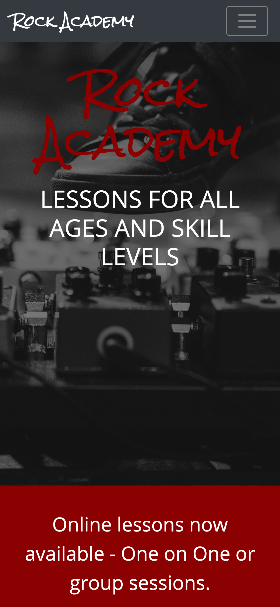

# Rock Academy - Music Lessons For Everyone

Rock Academy was meant to be a mock website for a music store that offers music lessons. This was one of the first websites that I created without looking at documentation. It's responsive to multiple breakpoints and features a spacious layout.

## Table of contents

- [Rock Academy - Music Lessons For Everyone](#rock-academy---music-lessons-for-everyone)
  - [Table of contents](#table-of-contents)
    - [Screenshots](#screenshots)
    - [Links](#links)
  - [My process](#my-process)
    - [Built with](#built-with)
  - [Author](#author)

### Screenshots

### Links

- Solution URL: [Github Repo](https://github.com/ayearicks/RockAcademy)
- Live Site URL: [Live Site](https://yearicks.dev/RockAcademy/index.html)

## My process

### Built with

- Semantic HTML5 markup
- Bootstrap 4
- CSS custom properties
- Visual Studio Code
- Chrome

## Author

- Website - [Ashley Yearicks](https://yearicks.dev)
- Twitter - [@jessarin5](https://www.twitter.com/jessarin5)
